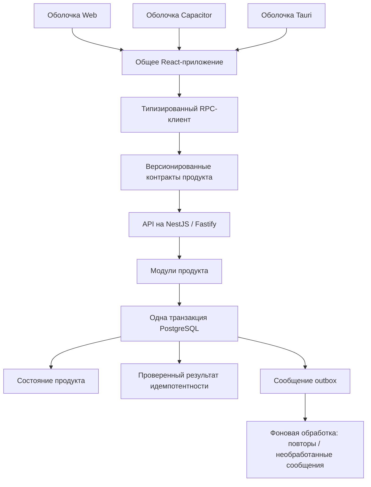

# Product Foundation

[English version](./README.md)

Product Foundation — техническая основа на TypeScript для приложений,
которые будут развиваться годами. Один код продукта работает в Web,
на iOS/Android через Capacitor и на настольных платформах через Tauri.
Серверная часть использует NestJS/Fastify, PostgreSQL, типизированный RPC
и фоновую обработку. Предметная область конкретного продукта в основу не входит.

**Статус: публичная бета-версия.** Реализованные механизмы и набор проверок
описаны в документации. Перед приёмом реального трафика продукту необходимо
добавить собственные идентификацию пользователей, авторизацию, развёртывание,
восстановление и проверки продуктовых сценариев.

## Для чего нужен этот репозиторий

Product Foundation подходит командам, которые строят долгоживущий модульный
монолит и хотят сохранить ясную ответственность за фронтенд на разных
платформах, контракты API, изменения базы и асинхронную работу. Повторяющиеся
технические решения здесь приняты заранее; поведение продукта определяет
его собственный репозиторий.

Основные правила проверяются кодом: вход и выход публичного RPC валидируются
во время выполнения; надёжные мутации фиксируют состояние, результат
идемпотентности и сообщения outbox вместе; изоляция арендаторов требует
принудительного RLS; границы оболочек и направление зависимостей пакетов
проверяются в CI.

Это не готовое SaaS-приложение, не фреймворк и не каталог адаптеров «на будущее».
Копирование создаёт самостоятельный снимок, за который отвечает команда продукта.

## Уже принятые технические решения

| Задача | Решение |
| --- | --- |
| Контракты продукта | Версионированные контракты процедур и проверка входа и выхода через Zod |
| Связь клиента и сервера | Типизированный RPC, независимый от транспорта |
| Повтор мутаций | Идемпотентность в PostgreSQL с обнаружением конфликта данных запроса |
| Состояние и асинхронные действия | Одна транзакция для состояния, результата идемпотентности и outbox |
| Сбои фоновой обработки | Ограниченное время владения заданием, повторы, токены захвата, сохранение и просмотр необработанных сообщений, сроки хранения |
| Изоляция арендаторов | Явная область арендатора, обязательный принудительный RLS PostgreSQL и негативные тесты |
| Изменение базы | Упорядоченные неизменяемые SQL-миграции с контрольными суммами |
| Серверное состояние | TanStack Query |
| Интерфейс продукта | Одно общее React-приложение |
| Платформы | Независимые оболочки Web, Capacitor и Tauri |
| Архитектура | Проверки ответственности, зависимостей и границ фреймворков и драйверов |
| Работа с ИИ | Локальные правила репозитория, воспроизводимые проверки и CI |

## Устройство системы



Диаграмма показывает ответственность и согласованность данных, а не перечень
пакетов. PostgreSQL — источник истины. Внешние действия выполняются после
фиксации транзакции идемпотентными фоновыми обработчиками.

## Четыре части основы

### Надёжность бэкенда

Серверные механизмы рассчитаны на конкретные сценарии отказа:

- Версионированные миграции с контрольными суммами позволяют проверять историю
  схемы и отклоняют изменение уже применённого SQL.
- Проверка контрактов не пропускает непроверенные данные на вход и выход обработчика.
- Каждая RPC-мутация требует ключ идемпотентности с сохранением результата,
  чтобы безопасный повтор возвращал прежний ответ.
- Состояние продукта, проверенный результат и запись outbox фиксируются
  или откатываются вместе.
- Временное владение сообщениями, токены захвата, повторы, сохранение
  необработанных сообщений и сроки хранения позволяют эксплуатировать доставку
  «как минимум один раз», не обещая «ровно один раз».
- Режим арендаторов считается завершённым, только когда их таблицы принудительно
  применяют RLS, а тесты запрета доступа между арендаторами проходят под рабочей
  ролью без прав суперпользователя.
- API и фоновый процесс предоставляют проверки работы и готовности,
  структурированную диагностику и метрики с ограниченным числом сочетаний меток.

[Пример надёжной операции](./docs/architecture/reference-durable-flow-RU.md)
проверяет главный инвариант транзакции и outbox на PostgreSQL, через HTTP
и в окружении Compose.

### Один фронтенд, независимые оболочки

Основной интерфейс и сценарии продукта находятся в
[packages/frontend-app](./packages/frontend-app).
[apps/web](./apps/web), [apps/mobile](./apps/mobile) и
[apps/desktop](./apps/desktop) отвечают только за свои точки входа, конфигурацию,
результаты сборки, жизненный цикл платформы, упаковку и реальные платформенные
интеграции. Общее приложение не импортирует Capacitor, Tauri, реализацию PWA
или `import.meta.env`.

Когда функции действительно нужна возможность платформы, создайте минимальный
явный интерфейс на границе потребителя и передайте адаптеры из оболочек:

```text
функция продукта → явный интерфейс возможности ← адаптер оболочки
```

Не создавайте универсальный реестр `PlatformServices` и не распространяйте
`if (platform === ...)`, `Capacitor.*` или вызовы Tauri по общему коду продукта.

Фронтенд следует облегчённому направлению Feature-Sliced Design:

```text
app → pages → widgets → features → entities → shared
```

Слои помогают находить код, определяют ответственность и зависимости вниз.
Они не обязывают создавать feature, entity и widget для каждого компонента.
Выбирайте простое размещение с понятным владельцем:
`features/open-modal`, `features/change-input` и `entities/button`
не создают полезной архитектуры. Серверное состояние принадлежит TanStack
Query, локальное — React. Глобальное клиентское хранилище добавляется только
по подтверждённой потребности продукта.

### RPC на основе контрактов

У границ продукта и механизмов протокола разные владельцы:

- [packages/contracts](./packages/contracts) — публичные процедуры продукта, DTO и схемы;
- [packages/rpc](./packages/rpc) — форматы сообщений, ошибки и базовые определения процедур;
- [packages/rpc-client](./packages/rpc-client) и
  [packages/rpc-server](./packages/rpc-server) — выполнение протокола;
- [apps/api](./apps/api) — конкретные обработчики продукта и сборка приложения.

```text
функция фронтенда
  → типизированный RPC-клиент
  → контракт продукта
  → проверка входа во время выполнения
  → обработчик
  → проверка выхода во время выполнения
  → типизированный результат
```

Контракты описывают публичные данные обмена. Репозитории, сервисы, DTO NestJS
и координация бизнес-операций туда не входят. Так несовместимые изменения
сосредоточены на явной границе, а детали транспорта и фреймворка не попадают
в схемы продукта. Фронтенд, бэкенд, люди и ИИ-агенты опираются на один контракт.

### Проверяемая архитектура и работа с ИИ

Разработчики и ИИ-агенты работают в одних архитектурных ограничениях:

```text
ближайший AGENTS.md
  → архитектурный замысел и предсказуемое размещение кода
  → автоматические проверки зависимостей и ответственности
  → тесты и CI
```

Не нужно заново проектировать систему под каждую задачу. Где живёт контракт,
куда направлены зависимости, какая оболочка владеет платформенным кодом
и какую транзакцию использует мутация — эти решения зафиксированы один раз.
Дальнейшая работа может сосредоточиться на продукте. Проверки ограничивают
ошибочные изменения независимо от соблюдения инструкций, но не доказывают
правильность сгенерированного кода.

Автоматически проверяются направление FSD и публичные интерфейсы слайсов,
принадлежность Capacitor, Tauri и PWA своим оболочкам, отсутствие доступа
к окружению сборки в общем фронтенде, место прямого `fetch`, зависимости
основы от продукта, серверные границы фреймворков и драйверов, циклы
и ответственность пакетов. Подробнее —
[автоматическая проверка архитектуры](./docs/architecture/executable-architecture-RU.md).

## Быстрое знакомство

Нужны Node.js 24, pnpm 11.7.0 и Docker с Compose либо PostgreSQL 17.

```bash
pnpm install --frozen-lockfile
cp .env.example .env
docker compose up --detach --wait database
pnpm db:migrate:dev
pnpm dev:demo
```

- Web: `http://localhost:1420`
- Готовность API: `http://localhost:3001/health/ready`
- Метрики API: `http://localhost:3001/metrics`

Затем изучите system-ping и пример надёжной операции, просмотрите план
переименования, выберите область данных `global` или `tenant` и добавьте
первый функциональный модуль продукта. Порядок и команды описаны в
[руководстве разработчика](./DEVELOPER_GUIDE-RU.md).

## Разбор надёжной операции

В репозитории один намеренно технический пример, без выдуманной предметной
области SaaS:

```text
проверенная надёжная мутация
  → одна транзакция PostgreSQL
      ├─ состояние продукта
      ├─ результат идемпотентности
      └─ событие outbox
  → захват сообщения фоновым процессом
  → при ошибке: повтор или сохранение как необработанного
```

Читайте по порядку:

1. [Контракт продукта](./packages/contracts/src/reference-durable-probe.ts).
2. [Прикладной обработчик](./apps/api/src/modules/reference/application/create-reference-durable-probe.ts).
3. [Репозиторий PostgreSQL](./apps/api/src/modules/reference/infrastructure/postgres-reference-durable-probe.repository.ts)
   и [миграция продукта](./apps/api/migrations/0001_reference_durable_probe.sql).
4. [Фоновый обработчик](./apps/api/src/modules/reference/infrastructure/create-reference-durable-probe-outbox-handler.ts)
   и его [регистрация](./apps/api/src/app/worker/create-outbox-handlers.ts).
5. [Интеграционный тест HTTP/PostgreSQL](./apps/api/src/app/http/reference-durable-probe.integration.test.ts)
   и [smoke-тест Compose](./scripts/smoke-compose.mjs).
6. [Объяснение всего пути](./docs/architecture/reference-durable-flow-RU.md).

Пример можно удалить после появления первого реального сквозного сценария
продукта с равноценным покрытием.

## Что решает продукт

Product Foundation не выбирает предметную область, провайдера идентификации
и сессий, систему прав, дизайн-систему, общее клиентское хранилище, объектное
хранилище, поиск, обмен в реальном времени, внешнюю очередь, платформу
развёртывания, хранилище секретов, систему телеметрии, подпись или выпуск
в магазинах. Абстракции для этого не добавляются до появления реального потребителя.

Перед приёмом трафика продукт отвечает за модель угроз, идентификацию
и авторизацию, политики арендаторов при необходимости, изоляцию секретов
и окружений, оповещения, проверку резервного копирования и восстановления,
сроки хранения и тесты собственных интеграций и восстановления.
См. [политику безопасности](./SECURITY-RU.md).

## Обновление снимка шаблона

Выпуски основы — снимки шаблона. После копирования:

- код основы принадлежит продукту;
- `FOUNDATION_VERSION` фиксирует исходную версию;
- исправления безопасности, целостности данных и надёжности просматриваются
  и переносятся командой;
- миграции и контракты продукта не сливаются автоматически.

Команда получает явный контроль над кодом, но берёт на себя перенос обновлений.
До серьёзной работы над продуктом прочитайте
[описание жизненного цикла шаблона](./docs/architecture/template-lifecycle-RU.md).

## Проверка

```bash
pnpm check          # документация, чистота, линтинг, архитектура, типы, инструменты, модульные тесты
TEST_DATABASE_URL=postgresql://... pnpm check:ci # также интеграционные тесты PostgreSQL
pnpm build          # рабочие сборки Web и API
pnpm smoke:api      # проверка скомпилированного API
pnpm smoke:compose  # миграции, API, надёжная мутация, outbox, фоновый процесс
pnpm check:native   # конфигурация Capacitor и Rust/Tauri
```

CI также проверяет PWA, изоляцию сборок фронтенда, компиляцию Android,
сборки Tauri, безопасность переименования, изменения зависимостей
и CodeQL, где он доступен. Объём и ограничения проверок описаны
в [готовности основы](./docs/architecture/foundation-readiness-RU.md).

## Документация

- [Руководство разработчика](./DEVELOPER_GUIDE-RU.md) — начало работы и внесение изменений.
- [Обзор архитектуры](./docs/architecture/README-RU.md) — решения и подробные правила.
- [Куда добавлять код](./docs/architecture/where-to-put-code-RU.md).
- [Протокол RPC](./docs/architecture/rpc-protocol-RU.md).
- [Изоляция арендаторов](./docs/architecture/tenant-isolation-RU.md).
- [Инструкция по эксплуатации](./docs/architecture/operations-runbook-RU.md).
- [Архитектурные решения](./docs/adr/README-RU.md).
- [Полное оглавление документации](./docs/README-RU.md).
- [Правила разработки с ИИ](./AGENTS-RU.md).
- [Участие в проекте](./CONTRIBUTING-RU.md), [безопасность](./SECURITY-RU.md),
  [история изменений](./CHANGELOG-RU.md) и [лицензия MIT](./docs/license-RU.md).
