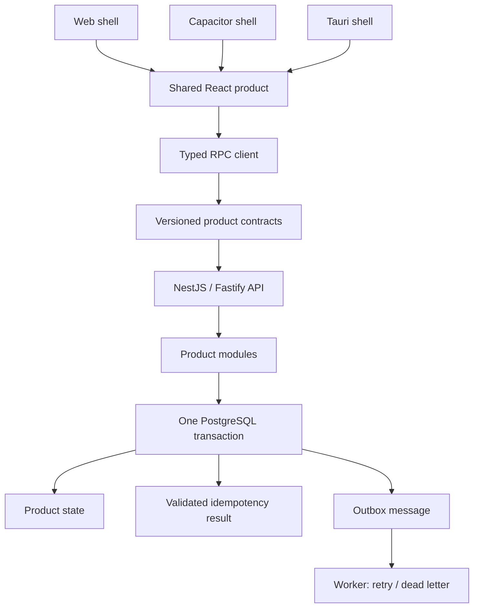

# Product Foundation

[Русская версия](./README-RU.md)

A production-oriented, product-neutral TypeScript foundation for long-lived applications that
share one product codebase across Web, iOS/Android through Capacitor, and desktop through Tauri,
with a NestJS/Fastify API, PostgreSQL, typed RPC, and background processing.

**Maturity:** public beta. The implemented mechanisms and verification matrix are documented, but
a copied product is not ready for real traffic until it supplies its own identity, authorization,
deployment, recovery, and product-specific tests.

## What it is — and why it is not a typical starter

Product Foundation is for teams building a modular monolith expected to evolve for years while
keeping frontend runtimes, API contracts, database changes, and asynchronous work under explicit
ownership. It fixes recurring technical decisions once, then leaves product behavior to the
product repository.

It is not a React/Nest/Postgres sample held together by conventions. Its central decisions are
executable: public RPC input and output are validated at runtime; durable mutations commit state,
the idempotency result, and outbox messages together; tenant isolation has a forced-RLS contract;
runtime shells and package dependency directions are checked in CI.

It is also not a framework, a finished SaaS application, or a catalogue of speculative adapters.
Copying the repository creates an independently owned product snapshot.

## Engineering decisions already made

| Concern | Foundation approach |
| --- | --- |
| Product contracts | Versioned procedure contracts and Zod runtime input/output validation |
| Client/server communication | Transport-independent typed RPC |
| Mutation retries | PostgreSQL-backed idempotency with payload conflict detection |
| State plus asynchronous effects | One transaction for state, idempotency result, and outbox |
| Worker failures | Leases, retry, claim fencing, dead letters, inspection, and retention |
| Tenant isolation | Explicit tenant scope, forced PostgreSQL RLS contract, and negative tests |
| Database evolution | Ordered, immutable, checksummed SQL migrations |
| Server state | TanStack Query |
| Product UI | One shared React application |
| Platforms | Independent Web, Capacitor, and Tauri runtime shells |
| Architecture | Executable ownership, dependency, framework, and driver boundaries |
| AI-assisted work | Repository-local rules plus deterministic verification and CI |

## System model



The diagram is an ownership and consistency model, not a package inventory. PostgreSQL is the
source of truth. External effects happen after commit through idempotent worker handlers; they are
not hidden inside an HTTP transaction.

## Four parts of the foundation

### Reliability-oriented backend

The backend mechanisms address specific failure modes:

- versioned, checksummed migrations make schema history reviewable and reject edited history;
- contract validation prevents unvalidated wire values from entering or leaving a handler;
- every RPC mutation requires a durable idempotency key, so safe retries return the stored result;
- product state, the validated result, and outbox append commit or roll back together;
- worker leases, fencing tokens, retry, dead letters, and retention make at-least-once delivery
  operable without pretending it is exactly once;
- tenant mode is complete only when tenant-owned tables force RLS and negative cross-tenant tests
  pass under the non-superuser runtime role;
- API and worker expose health, readiness, structured diagnostics, and low-cardinality metrics.

The [durable reference flow](./docs/architecture/reference-durable-flow.md) proves the central
transaction/outbox invariant against PostgreSQL, over HTTP, and in the Compose runtime.

### One frontend, independent runtime shells

Most product UI and product flows live once in [`packages/frontend-app`](./packages/frontend-app).
[`apps/web`](./apps/web), [`apps/mobile`](./apps/mobile), and
[`apps/desktop`](./apps/desktop) own only their entrypoint, build/runtime configuration, artifacts,
platform lifecycle, packaging, and real platform integrations. The shared application does not
import Capacitor, Tauri, PWA implementation code, or `import.meta.env`.

When a real feature needs a platform capability, add the smallest explicit interface at the
consumer boundary and supply Web/Mobile/Desktop adapters from the shells:

```text
feature → explicit capability interface ← shell adapter
```

Do not introduce a generic `PlatformServices` registry, and do not spread `if (platform === ...)`,
`Capacitor.*`, or Tauri calls through shared product code.

The frontend uses a lightweight Feature-Sliced direction:

```text
app → pages → widgets → features → entities → shared
```

These layers exist for predictable ownership, discoverability, and downward dependencies. They are
not a requirement to manufacture a feature/entity/widget for every component. Prefer the simplest
placement that preserves a clear owner; `features/open-modal`, `features/change-input`, and
`entities/button` are not useful architecture. Server state belongs to TanStack Query, local state
to React, and a global client store is added only for a demonstrated product need.

### Contract-first RPC

Product boundaries and protocol mechanics have different owners:

- [`packages/contracts`](./packages/contracts) owns public product procedures, DTOs, and schemas;
- [`packages/rpc`](./packages/rpc) owns protocol envelopes, errors, and procedure primitives;
- [`packages/rpc-client`](./packages/rpc-client) and
  [`packages/rpc-server`](./packages/rpc-server) execute that protocol;
- [`apps/api`](./apps/api) owns concrete product handlers and runtime composition.

```text
frontend feature
  → typed RPC client
  → product contract
  → runtime input validation
  → handler
  → runtime output validation
  → typed result
```

Contracts contain public wire boundaries, not repositories, services, NestJS DTOs, or business
orchestration. This localizes breaking changes, keeps transport/framework details out of product
schemas, and gives frontend, backend, humans, and coding agents the same explicit boundary.

### Executable architecture and AI-assisted development

Product Foundation is structured so human developers and coding agents operate under the same
architectural constraints:

```text
nearest AGENTS.md
  → architecture intent and predictable locations
  → executable dependency/ownership checks
  → tests and CI
```

The goal is not to let an agent redesign the system for every task. Repeated decisions—where a
contract lives, which direction dependencies point, which shell owns platform code, and which
transaction a mutation uses—are encoded once so implementation work can focus mainly on product
behavior. Checks enforce important boundaries independently of prompt compliance. They reduce the
space of incorrect changes; they do not guarantee that generated code is correct.

Examples checked automatically include FSD direction and slice public APIs; shell ownership of
Capacitor, Tauri, and PWA code; absence of build-environment access in the shared frontend; direct
`fetch` ownership; foundation-to-product dependency direction; backend framework/driver
boundaries; workspace cycles; and package ownership. See
[executable architecture](./docs/architecture/executable-architecture.md).

## Shortest useful path

Requirements: Node.js 24, pnpm 11.7.0, and Docker with Compose (or PostgreSQL 17).

```bash
pnpm install --frozen-lockfile
cp .env.example .env
docker compose up --detach --wait database
pnpm db:migrate:dev
pnpm dev:demo
```

- Web: `http://localhost:1420`
- API readiness: `http://localhost:3001/health/ready`
- API metrics: `http://localhost:3001/metrics`

Then inspect the system ping and durable flow, preview the product rename, choose `global` or
`tenant` data scope, and create the first product capability. The exact sequence and commands are
in the [Developer guide](./DEVELOPER_GUIDE.md).

## Follow the durable reference flow

There is one deliberately technical reference capability rather than a fake SaaS domain:

```text
validated durable mutation
  → one PostgreSQL transaction
      ├─ product state
      ├─ idempotency result
      └─ outbox event
  → worker claim
  → retry or dead letter on failure
```

Read it in order:

1. [product contract](./packages/contracts/src/reference-durable-probe.ts);
2. [application handler](./apps/api/src/modules/reference/application/create-reference-durable-probe.ts);
3. [PostgreSQL repository](./apps/api/src/modules/reference/infrastructure/postgres-reference-durable-probe.repository.ts)
   and [product migration](./apps/api/migrations/0001_reference_durable_probe.sql);
4. [worker handler](./apps/api/src/modules/reference/infrastructure/create-reference-durable-probe-outbox-handler.ts)
   and [registration](./apps/api/src/app/worker/create-outbox-handlers.ts);
5. [HTTP/PostgreSQL integration test](./apps/api/src/app/http/reference-durable-probe.integration.test.ts)
   and [Compose smoke](./scripts/smoke-compose.mjs);
6. [flow explanation](./docs/architecture/reference-durable-flow.md).

Products can remove the reference capability after their first real vertical slice provides
equivalent coverage.

## What remains a product decision

Product Foundation intentionally does not choose the product domain, identity/session provider,
permission vocabulary, design system, global client store, object storage, search, realtime,
external queue, deployment platform, secrets system, telemetry backend, signing, or store release
process. It does not add abstractions for those concerns before a product has a concrete consumer.

Before real traffic, the product owns its threat model, identity and authorization, tenant policies
when applicable, secret and deployment isolation, alerts, backup/restore drills, data retention,
and product-specific integration and recovery tests. See [SECURITY.md](./SECURITY.md).

## Snapshot lifecycle and trade-off

Foundation releases are template snapshots, not automatic framework upgrades. After copying:

- the foundation code belongs to the product;
- `FOUNDATION_VERSION` records the starting point;
- upstream security, data-integrity, and reliability fixes are reviewed and ported deliberately;
- product migrations and contracts never receive unattended merges.

This trades update convenience for explicit ownership and safer reconciliation. Read the
[template lifecycle](./docs/architecture/template-lifecycle.md) before substantial product work.

## Verification

```bash
pnpm check          # docs, hygiene, static, architecture, types, tooling, unit tests
TEST_DATABASE_URL=postgresql://... pnpm check:ci # plus PostgreSQL integration tests
pnpm build          # production Web and API
pnpm smoke:api      # compiled API smoke
pnpm smoke:compose  # migrations, API, durable mutation, outbox, worker
pnpm check:native   # Capacitor configuration and Rust/Tauri
```

CI also verifies PWA behavior, isolated frontend artifacts, Android compilation, Tauri builds,
rename safety, dependency changes, and CodeQL where available. Verification scope and limits are
documented in [foundation readiness](./docs/architecture/foundation-readiness.md).

## Documentation map

- [Developer guide](./DEVELOPER_GUIDE.md) — practical onboarding and change map
- [Architecture overview](./docs/architecture/README.md) — rationale and deeper rules
- [Where to put code](./docs/architecture/where-to-put-code.md)
- [RPC protocol](./docs/architecture/rpc-protocol.md)
- [Tenant isolation](./docs/architecture/tenant-isolation.md)
- [Operations runbook](./docs/architecture/operations-runbook.md)
- [Architecture decisions](./docs/adr/README.md)
- [Complete documentation index](./docs/README.md)
- [AI development rules](./AGENTS.md)
- [Contributing](./CONTRIBUTING.md), [security](./SECURITY.md), [changelog](./CHANGELOG.md), and
  [MIT license](./docs/license.md)
