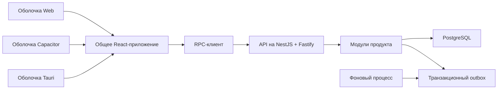

# Целевая архитектура

[English version](./target-architecture.md)

## Общая модель

Основа проекта — модульный монолит: один API, одна база PostgreSQL и отдельно
запускаемый фоновый процесс. Так единиц развёртывания остаётся немного,
а внутренние границы кода — явными.



## Фронтенд

Продукт реализуется один раз в `packages/frontend-app`. Оболочки Web, Mobile
и Desktop запускают его и предоставляют адаптеры для своих платформ.

У каждой оболочки своя точка входа Vite и свой каталог dist. При запуске
`createFrontendApp` получает неизменяемую конфигурацию и fetch; конкретный
API-провайдер предоставляет используемые RPC-операции. Общего контекста
сервисов или универсального реестра зависимостей нет.

Только Web отвечает за регистрацию сгенерированного service worker, предложение
«Перезагрузить / Позже» и кеширование статической оболочки. Работа с продуктовыми
данными без сети в основу не входит. См. [ADR 0011](../adr/0011-frontend-runtime-composition-RU.md)
и [ADR 0012](../adr/0012-web-only-pwa-RU.md).

Фронтенд использует облегчённую структуру Feature-Sliced Design:

```text
app → pages → widgets → features → entities → shared
```

Слои задают ответственность и направление зависимостей, помогают находить код.
Не нужно механически раскладывать каждый компонент по категориям и создавать
feature, entity и widget для каждой мелочи. Выбирайте простую структуру с понятным
владельцем и зависимостями вниз по слоям. Каталоги `features/open-modal`,
`features/change-input` и `entities/button` полезной границы не создают.

Серверное состояние хранится в TanStack Query. Если продукту действительно
понадобится общее клиентское состояние, можно добавить Zustand; неиспользуемого
хранилища в основе нет. Код транспорта разрешён только в `shared/api`.

Общий фронтенд не импортирует Capacitor, Tauri, реализацию PWA и переменные
окружения сборки. Возможности платформы добавляются по потребности: узкий
интерфейс в общем коде продукта и конкретные адаптеры в оболочках. Универсальный
реестр сервисов заранее не создаётся. Проверки платформы и прямые вызовы
нативных API не должны распространяться по features.

## Бэкенд

NestJS отвечает за внедрение зависимостей, жизненный цикл, модули, контроллеры
и фильтры. Fastify служит HTTP-адаптером. Бизнес-код остаётся обычным TypeScript.

Внутри функционального модуля:

```text
transport/infrastructure → application → domain
```

- `transport` знает о NestJS и RPC;
- `infrastructure` реализует репозитории продукта и интерфейсы интеграций;
- `application` координирует проверку прав, репозитории и транзакции;
- `domain` содержит чистые правила и инварианты.

Выделяйте отдельный сервис только при подтверждённой необходимости: независимое
масштабирование, граница безопасности, отдельная команда-владелец или другой
жизненный цикл.

## RPC

В `packages/contracts` находятся процедуры продукта и схемы Zod. Формат
сообщений протокола принадлежит `@product-foundation/rpc`. DTO NestJS и типы
серверной реализации не являются публичным контрактом.

У каждого запроса есть версия, идентификатор, проверка входа и выхода во время
выполнения и единый типизированный формат ошибок.

## Данные

PostgreSQL — источник истины. Пакет `backend-postgres` отвечает за пул соединений,
механизм транзакций, запуск миграций, идемпотентность и outbox.

Таблицы и репозитории продукта принадлежат соответствующему модулю.
`DATA_SCOPE_MODE` выбирает обычные интерфейсы транзакций либо исполнитель
транзакций с обязательным `TenantScope`. Изменение состояния и его событие
outbox записываются в одной транзакции.

Миграции основы используют пространство имён `foundation`. Для миграций продукта
есть каталог `apps/api/migrations`; они используют другое постоянное пространство
имён. Уже применённый SQL изменять нельзя.

## Безопасность и эксплуатация

Базовые правила на границах системы:

- доступ запрещён, пока он явно не разрешён;
- конфигурация окружения проверяется;
- CORS использует список разрешённых источников; ограничены размер тела и частота
  запросов, настроены защитные заголовки;
- структурированные логи не раскрывают чувствительные данные;
- доступны проверки liveness/readiness и метрики с небольшим числом сочетаний меток;
- API и фоновый процесс корректно завершают работу.

Провайдера идентификации, права, экспорт трассировок, очереди, поиск и платформу
развёртывания выбирает конкретный продукт и фиксирует решения в ADR.
