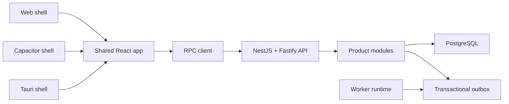

# Target architecture

## Общая модель

База начинается как модульный монолит: один API, одна PostgreSQL и отдельно
запускаемый worker. Это минимальное число deploy units при чётких внутренних
границах.



## Frontend

Продукт пишется один раз в `packages/frontend-app`. Web, mobile и desktop shells
только запускают его и предоставляют platform adapters.

Frontend использует облегчённый Feature-Sliced Design:

```text
app → pages → widgets → features → entities → shared
```

Server state хранится в TanStack Query. Если продукту действительно нужен общий client state,
он может отдельно добавить Zustand; foundation не устанавливает неиспользуемый store. Прямой
transport code разрешён только в `shared/api`.

## Backend

NestJS отвечает за DI, lifecycle, modules, controllers и filters. Fastify — HTTP
adapter. Бизнес-код остаётся plain TypeScript.

Внутри capability:

```text
transport/infrastructure → application → domain
```

- `transport` знает NestJS/RPC;
- `infrastructure` реализует product repository и integration ports;
- `application` координирует permissions, repositories и transaction;
- `domain` содержит чистые правила и invariants.

Выделять отдельный service можно только при измеренной причине: независимый
scale, security boundary, отдельный owner или другой lifecycle.

## RPC

`packages/contracts` хранит product procedures и Zod schemas. Protocol envelope
находится в `@product-foundation/rpc`. NestJS DTO и server implementation types
не являются публичным контрактом.

Каждый request имеет version, request ID, runtime input/output validation и
единый typed error envelope.

## Data

PostgreSQL — source of truth. `backend-postgres` владеет pool, transaction
mechanics, migration runner, idempotency и outbox primitives.

Product tables и repositories принадлежат capability. `DATA_SCOPE_MODE` выбирает
global transaction ports либо tenant-only runner с явным `TenantScope`. Изменение
state и outbox event записываются одной транзакцией.

Foundation migrations используют namespace `foundation`. Product migrations уже
имеют каталог `apps/api/migrations`, используют другой стабильный namespace и
никогда не редактируют применённый SQL.

## Security и operations

Boundary defaults:

- deny-by-default authorization;
- validated environment;
- CORS allowlist, body/rate limits и security headers;
- redacted structured logs;
- liveness/readiness и low-cardinality metrics;
- graceful shutdown API и worker.

Identity provider, permissions, tracing exporter, queue/search providers и
deployment platform выбираются конкретным продуктом через ADR.
