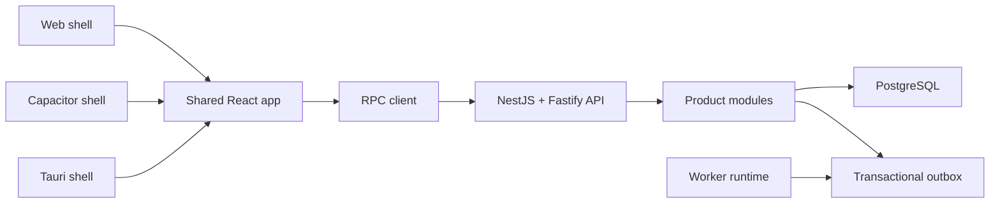

# Target architecture

[Русская версия](./target-architecture-RU.md)

## Overall model

The foundation starts as a modular monolith: one API, one PostgreSQL database and
a separately launched worker. This keeps the number of deployment units small
while preserving clear internal boundaries.


```mermaid
flowchart LR
  Web["Web shell"] --> Frontend["Shared React app"]
  Mobile["Capacitor shell"] --> Frontend
  Desktop["Tauri shell"] --> Frontend
  Frontend --> Client["RPC client"]
  Client --> API["NestJS + Fastify API"]
  API --> Modules["Product modules"]
  Modules --> DB["PostgreSQL"]
  Modules --> Outbox["Transactional outbox"]
  Worker["Worker runtime"] --> Outbox
```

## Frontend

The product is implemented once in `packages/frontend-app`. Web, mobile and
desktop shells launch it and supply platform adapters.

Each shell has an independent Vite entrypoint and local dist. Bootstrap passes
immutable configuration and fetch into createFrontendApp; a concrete API provider
owns the current RPC operations. There is no generic runtime/service-locator context.
Web alone owns generated PWA registration, a Reload/Later prompt and static-shell
caching. Product data has no offline semantics in the foundation.
See [ADR 0011](../adr/0011-frontend-runtime-composition.md) and
[ADR 0012](../adr/0012-web-only-pwa.md).

The frontend uses a lightweight Feature-Sliced Design structure:

```text
app → pages → widgets → features → entities → shared
```

Layers define ownership and dependency direction and help readers find code.
They are not a classification exercise for every component. Do not create a
feature, entity and widget for every small change. Prefer the simplest structure
with clear ownership and downward dependencies; `features/open-modal`,
`features/change-input` and `entities/button` add no useful boundary.

TanStack Query owns server state. A product may add Zustand when shared client
state actually requires it; the foundation does not install an unused store.
Direct transport code is allowed only in `shared/api`.

The shared frontend does not import Capacitor, Tauri, PWA implementation or build
environment values. Add a platform capability when a consumer needs it: define
a narrow interface in shared product code and concrete adapters in runtime shells.
Do not create a generic service locator in advance. Keep platform conditionals
and direct native API calls out of features.

## Backend

NestJS owns dependency injection, lifecycle, modules, controllers and filters.
Fastify is the HTTP adapter. Business code remains plain TypeScript.

Within a capability:

```text
transport/infrastructure → application → domain
```

- `transport` knows NestJS and RPC;
- `infrastructure` implements product repositories and integration ports;
- `application` coordinates permissions, repositories and transactions;
- `domain` contains pure rules and invariants.

Extract a separate service only for a demonstrated reason: independent scaling,
a security boundary, a separate owner or a different lifecycle.

## RPC

`packages/contracts` contains product procedures and Zod schemas. The protocol
envelope belongs to `@product-foundation/rpc`. NestJS DTOs and server
implementation types are not public contracts.

Every request has a version, request ID, runtime input/output validation and
a common typed error envelope.

## Data

PostgreSQL is the source of truth. `backend-postgres` owns the pool, transaction
mechanics, migration runner, idempotency and outbox primitives.

Product tables and repositories belong to their capability. `DATA_SCOPE_MODE`
selects global transaction ports or a tenant-only runner with explicit
`TenantScope`. A state change and its outbox event share one transaction.

Foundation migrations use the `foundation` namespace. Product migrations have
a dedicated directory, `apps/api/migrations`, and use another stable namespace.
Applied SQL must never be edited.

## Security and operations

Boundary defaults:

- deny-by-default authorization;
- validated environment;
- CORS allowlist, body/rate limits and security headers;
- redacted structured logs;
- liveness/readiness and low-cardinality metrics;
- graceful API and worker shutdown.

Each product selects its identity provider, permissions, tracing exporter,
queue/search providers and deployment platform through ADRs.
